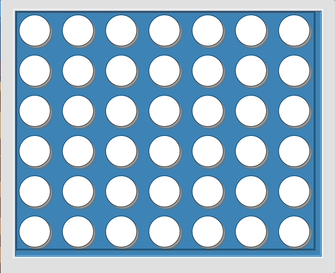

# 🎮 Connect4 AI 🤖



Welcome to Connect4 AI – the classic board game brought to life with artificial intelligence! Challenge yourself against a computer opponent that uses advanced algorithms to make strategic moves. Whether you're a casual player looking for fun or a strategy enthusiast wanting to test your skills, this game offers an engaging experience for everyone! 🎲✨

## ✨ Features ✨

### 🧠 Three Difficulty Levels:
- 😌 **Easy**: Perfect for casual players or beginners learning the game. The AI makes less calculated moves, giving you room to develop your strategy! 🎯
- 🤔 **Medium**: A balanced challenge that requires thoughtful planning to win. Test your tactical skills! 💡
- 😱 **Hard**: Face off against a formidable opponent using maximum search depth. Only the most skilled players will triumph! 🏆

### 🔄 Game Elements:
- **Classic Connect4 Gameplay**: Drop discs into the grid and try to connect four of your color in a row, column, or diagonal before the AI does! 🎯
- **Visual Feedback**: Winning combinations are highlighted when the game ends! 🌟
- **Clean, Modern UI**: A sleek interface with vibrant colors and smooth animations for an enjoyable gaming experience! 🎨

## 🎲 What's Under the Hood?

### AI Logic:
- **Monte Carlo Tree Search (MCTS)**: 
  - A powerful algorithm that simulates thousands of possible game outcomes to determine the best move! 🧮
  - The search depth varies by difficulty level, affecting how "far ahead" the AI can see. 🔍
  - Uses exploitation vs. exploration balance to find optimal moves without exhaustive search. 🤓

### Game Design:
- Built with Python and Tkinter for a lightweight, cross-platform experience. 🐍
- Object-oriented architecture for clean code organization and easy extensibility. 📚
- Board evaluation using strategic pattern recognition for four-in-a-row detection. 🎯

## 🚀 How to Play

1. Clone this repository to your local machine:
```bash
git clone https://github.com/yourusername/Connect4-AI.git
cd Connect4-AI
```

2. Make sure you have Python installed (Python 3.6 or higher recommended).

3. Launch the game:
```bash
python game.py
```

4. Gameplay:
   - Click on a column to drop your disc (yellow)
   - Try to connect four discs in a row, column, or diagonal
   - The AI (red) will automatically make its move after yours
   - Choose your difficulty level from the dropdown menu

## 🎯 Strategy Tips

- Control the center! The middle columns offer more opportunities to connect four.
- Think defensively - block the AI's potential winning moves.
- Plan several moves ahead, especially on higher difficulties.
- Try different strategies against each difficulty level to improve your skills!

## 📋 Future Enhancements

- Player vs. Player mode
- Game history and statistics tracking
- Custom board sizes and game rules
- Network play capabilities

Enjoy the challenge of strategic thinking and have fun outsmarting the AI! 🎮✨

---
*Originally created by Alfredo de la Fuente (2017) and enhanced with modern features (2024).*

## License

This project is licensed under the MIT License - see the [LICENSE.md](https://github.com/Alfo5123/Connect4/blob/master/LICENSE) file for details

## Acknowledgments

* Samuel Vidal, for suggesting this challenge.

